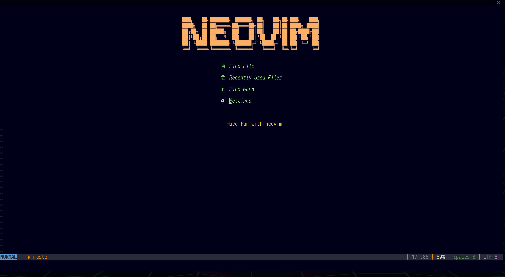
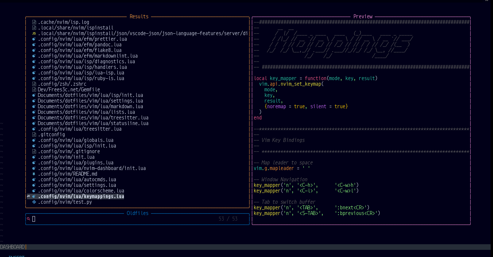
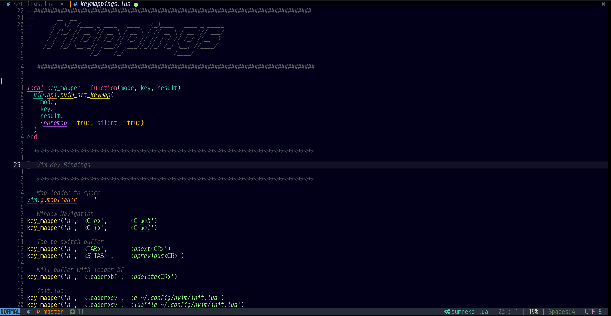

# My config for Neovim init.lua

> WiP:
>
> TODO//
>
> - fix auto commands
> - fix indenting
> - list key mappings
> - Tidy up lsp/init.lua

------------------------------------------------------------------------

## Install

**Install packer**:
[Packer.nvim](https://github.com/wbthomason/packer.nvim)

To get started, first clone this repository to somewhere on your
packpath, e.g.:

``` bash
git clone https://github.com/wbthomason/packer.nvim\
 ~/.local/share/nvim/site/pack/packer/start/packer.nvim
```

## Lsp

Install a supported language server, tab completion is supported:
`:LspInstall <Language server>`

`:LspInstall python lua diagnostics bash json html yaml vim css php ruby`

## Install efm-langserver

`go get github.com/mattn/efm-langserver`

------------------------------------------------------------------------

## Formatters and Linters

### Python

``` bash
pip3 install --user flake8
pip3 install --user yapf
pip3 install --user autopep8
```

### Lua

`npm install -g lua-fmt`

**Yaml, Json, Javascript, HTML, CSS:**

`npm install -g prettier`

### Markdown

``` bash
npm install -g markdownlint-cli
# for mac os :
brew install markdownlint-cli

pandoc
```

### PHP

``` bash
  npm install -g intelephense
```

------------------------------------------------------------------------

## screenshots

[](lua/nvim-dashboard/dashboard.png)

[](lua/nvim-telescope/telescope.png)

[](screenshot.png)
