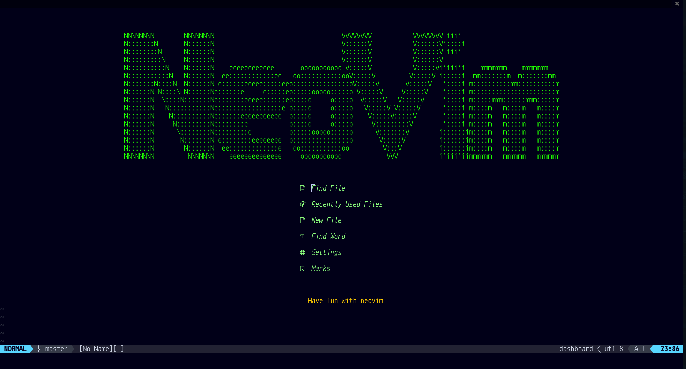
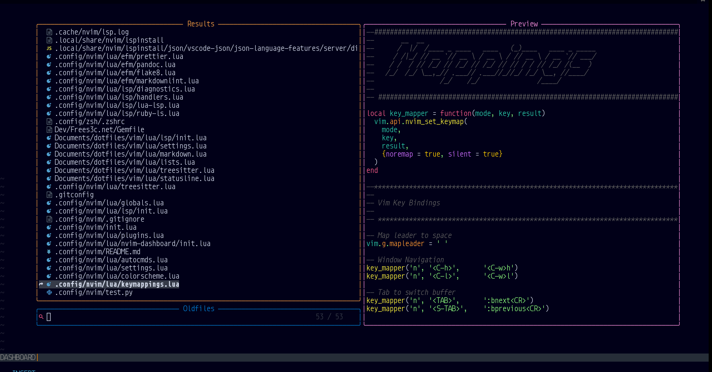
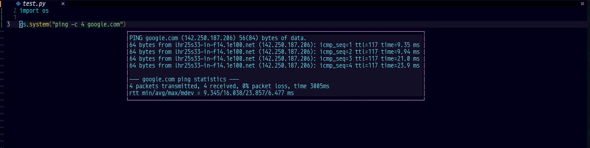
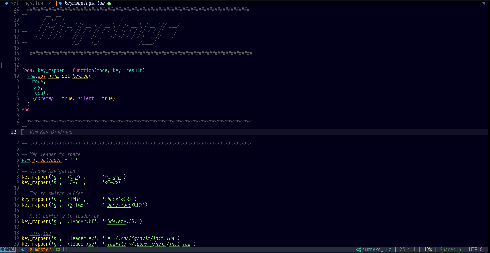

# My config for Neovim 0.5 init.lua

> WiP:
>
> TODO//
>
> - ## Make a better README.md

## Install

**Install packer**:
[Packer.nvim](https://github.com/wbthomason/packer.nvim)

To get started, first clone this repository to somewhere on your
packpath, e.g.:

``` bash
git clone https://github.com/wbthomason/packer.nvim\
 ~/.local/share/nvim/site/pack/packer/start/packer.nvim
```

## Lsp

Install a supported language server, tab completion is supported:

``` bash
:LspInstall <Language Server>
```

Languages used in this config :
`python, lua, diagnostics, bash, json, html, yaml, vim, css, php, ruby,latex`

## Install efm-langserver

`go get github.com/mattn/efm-langserver`

------------------------------------------------------------------------

## Formatters and Linters

### Python

``` bash
pip3 install --user flake8
pip3 install --user yapf
pip3 install --user autopep8
```

### Lua

`npm install -g lua-fmt`

### Yaml, Json, Javascript, HTML, CSS

`npm install -g typescript typescript-language-server`
`npm i -g eslint_d prettier`

### Markdown

``` bash
npm install -g markdownlint-cli
# for mac os :
brew install markdownlint-cli

pandoc
```

### PHP

``` bash
  npm install -g intelephense
```

------------------------------------------------------------------------

## Screenshots

**Dashboard.nvim**:
[](Screenshots/dashboard.png)

**Telescope.nvim**:
[](Screenshots/telescope.png)

**SnipRun.nvim**:
[](Screenshots/SnipRun_float.png)

**Neovim**:
[](Screenshots/screenshot.png)
